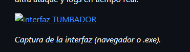

# 🎮 TUMBADOR DE KAHOOT (Kahoot "Hacks")

**Español** · [English](#-english)

Herramienta de escritorio y web para lanzar bots en partidas de Kahoot: entrar con un montón de nombres, modo ultra ataque y logs en tiempo real.



*Captura de la interfaz (navegador o .exe).*

---

## ✨ Qué hace

- **🤖 Entrar bots**  
  Introduce el PIN del juego, el número de bots (por defecto 50) y opcionalmente una lista de nombres. Los bots se unen a la sala en paralelo. Si no pones nombres, se usan 50 nombres por defecto (comunes en España). Los nombres duplicados se evitan añadiendo sufijos (`.`, `2`, etc.).

- **⚡ Ultra ataque**  
  Bucle automático: 50 bots → esperar 4 s → sacar todos → repetir. Opción *"Enviar bots continuamente"* para mandar 50 bots cada 1 s (desactivada por defecto).

- **📋 Logs**  
  Pestaña universal con el último código (PIN) usado y la lista de actividad. Cualquier dispositivo que use el mismo servidor ve los mismos logs. Botón para limpiar el log.

El servidor escucha en el **puerto 32853** en **0.0.0.0**, así que puedes abrir la interfaz desde otro dispositivo en la red usando tu IP (por ejemplo `http://192.168.1.10:32853`).

---

## 📥 Descargar ya compilado (Releases)

👉 **[Releases — TUMBADOR DE KAHOOT](https://github.com/PoxiiTV/TUMBADOR-DE-KAHOOT-Kahoot-Hacks-/releases)**

Descarga el ZIP de la última release. **No hace falta instalar Node.js ni nada:** el .exe lleva todo incluido.

### Instrucciones de uso (versión .exe)

1. **Descomprime** el ZIP en una carpeta.
2. Dentro debe haber el **.exe** y la carpeta **`public`** (juntos en la misma carpeta).
3. **Ejecuta el .exe.** Se abrirá una ventana negra del servidor y **el navegador** con la interfaz en `http://localhost:32853`.
4. **No cierres** la ventana del servidor mientras uses la app. Para salir, cierra esa ventana y la pestaña del navegador.
5. Opcional: desde otro dispositivo en la red puedes abrir `http://TU_IP:32853` (sustituye TU_IP por la IP del PC donde corre el .exe).

---

## 📋 Qué hace falta para que funcione

- **Si usas el .exe de Releases:** nada. Solo descomprimir el ZIP y ejecutar el .exe (con la carpeta `public` junto a él).
- **Si quieres ejecutar el código o compilar tú el .exe:**  
  - **Node.js** (v16 o superior). [Descarga Node.js](https://nodejs.org/) si no lo tienes.  
  - En la carpeta del proyecto: `npm install` y luego `npm run build` o `compilar-exe.bat`.

---

## 🚀 Cómo ejecutar el proyecto

### Opción 1: Navegador (desarrollo)

1. En la carpeta del proyecto: `npm install` y luego `npm run web` (o `iniciar-servidor.bat`).
2. Abre en el navegador: **http://localhost:32853**

### Opción 2: Ventana de escritorio (Electron)

1. Arranca el servidor en una terminal: `iniciar-servidor.bat` o `npm run web`. Deja esa ventana abierta.
2. En otra terminal: `npm run electron`. Se abrirá la ventana de TUMBADOR.

### Opción 3: Un solo .exe (portable)

Ejecuta el .exe (con la carpeta **`public`** junto a él). Se abrirá una ventana del servidor y **el navegador** con la interfaz en `http://localhost:32853`. No cierres la ventana del servidor mientras uses la app.

---

## 🔨 Cómo generar el .exe (para subir a Releases)

Desde la carpeta del proyecto, con Node.js instalado:

```bash
npm install
npm run build
```

O doble clic en **`compilar-exe.bat`**.

En la carpeta **`dist`** se generan:
- **`TUMBADOR-Kahoot-Hacks-1.0.0.exe`** (o la versión que tengas en `package.json`)
- **`public/`** (carpeta con la interfaz web)

**Para subir a Releases:** comprime en un ZIP la carpeta **`dist`** completa (el .exe y la carpeta `public` dentro del ZIP). Los usuarios descomprimen y ejecutan el .exe; no necesitan Node.

---

## 📁 Estructura del proyecto (resumen)

| Archivo / carpeta   | Uso |
|---------------------|-----|
| `electron.js`       | Opcional: ventana Electron; para desarrollo con `npm run electron`. |
| `server.js`         | Servidor Express (API y bots). Es el .exe: al ejecutarlo abre el navegador en localhost:32853. |
| `runBots.js`        | Lógica de los bots (nombres por defecto, `runBots`, referencias a clientes). |
| `public/`           | Interfaz web (HTML, CSS, JS). |
| `icono.png`         | Icono de la aplicación (opcional; recomendado para el .exe). |

---

## ⚠️ Aviso legal y uso responsable

**El autor de este proyecto no se hace responsable del uso que se haga de este software.** Esta herramienta se distribuye "tal cual", solo con fines educativos y de entretenimiento. Quien la use es el único responsable de cumplir las leyes aplicables y las condiciones de uso de Kahoot y de cualquier plataforma o contexto en que se utilice. No fomentamos su uso para trampas en entornos académicos ni para perjudicar a terceros. **Usa bajo tu propia responsabilidad.**

---

## 📄 Licencia

Proyecto de código abierto. Si lo subes a GitHub, indica la licencia que prefieras (MIT, GPL, etc.) en el repositorio.

---

# 🌐 English

Desktop and web tool to run bots in Kahoot games: join with many names, ultra-attack mode, and real-time logs.


*Screenshot of the interface (browser or .exe).*

---

## ✨ What it does

- **🤖 Join bots**  
  Enter the game PIN, number of bots (default 50), and optionally a list of names. Bots join the lobby in parallel. If you don't provide names, 50 default names are used (common in Spain). Duplicate names are avoided by adding suffixes (`.`, `2`, etc.).

- **⚡ Ultra attack**  
  Automatic loop: 50 bots → wait 4 s → remove all → repeat. Option *"Send bots continuously"* to send 50 bots every 1 s (off by default).

- **📋 Logs**  
  Universal tab with the last PIN used and the activity list. Any device using the same server sees the same logs. Button to clear the log.

The server listens on **port 32853** on **0.0.0.0**, so you can open the interface from another device on the network using your IP (e.g. `http://192.168.1.10:32853`).

---

## 📥 Download pre-built (Releases)

👉 **[Releases — TUMBADOR DE KAHOOT](https://github.com/PoxiiTV/TUMBADOR-DE-KAHOOT-Kahoot-Hacks-/releases)**

Download the latest release ZIP. **No need to install Node.js or anything else:** the .exe is self-contained.

### How to use (.exe version)

1. **Unzip** the ZIP into a folder.
2. You should see the **.exe** and the **`public`** folder in the same folder.
3. **Run the .exe.** A server window will open and **your browser** will open the interface at `http://localhost:32853`.
4. **Do not close** the server window while using the app. To exit, close that window and the browser tab.
5. Optional: from another device on the network you can open `http://YOUR_IP:32853` (replace YOUR_IP with the PC’s IP where the .exe is running).

---

## 📋 Requirements

- **If you use the .exe from Releases:** none. Just unzip and run the .exe (keep the `public` folder next to it).
- **If you want to run the source or build the .exe yourself:**  
  - **Node.js** (v16 or newer). [Download Node.js](https://nodejs.org/) if you don’t have it.  
  - In the project folder: `npm install` then `npm run build` or `compilar-exe.bat`.

---

## 🚀 How to run the project

### Option 1: Browser (development)

1. In the project folder: `npm install` then `npm run web` (or `iniciar-servidor.bat`).
2. Open in your browser: **http://localhost:32853**

### Option 2: Desktop window (Electron)

1. Start the server in one terminal: `iniciar-servidor.bat` or `npm run web`. Keep that window open.
2. In another terminal: `npm run electron`. The TUMBADOR window will open.

### Option 3: Single .exe (portable)

Run the .exe (with the **`public`** folder next to it). A server window will open and **your browser** will open the interface at `http://localhost:32853`. Don’t close the server window while using the app.

---

## 🔨 How to build the .exe (for Releases)

From the project folder, with Node.js installed:

```bash
npm install
npm run build
```

Or double-click **`compilar-exe.bat`**.

The **`dist`** folder will contain:
- **`TUMBADOR-Kahoot-Hacks-1.0.0.exe`** (or your `package.json` version)
- **`public/`** (folder with the web UI)

**To upload to Releases:** zip the entire **`dist`** folder (the .exe and the `public` folder inside the ZIP). Users unzip and run the .exe; they don’t need Node.

---

## 📁 Project structure (summary)

| File / folder   | Purpose |
|-----------------|---------|
| `electron.js`   | Optional: Electron window; for development with `npm run electron`. |
| `server.js`    | Express server (API and bots). This is what the .exe runs: it opens the browser at localhost:32853. |
| `runBots.js`   | Bot logic (default names, `runBots`, client references). |
| `public/`      | Web UI (HTML, CSS, JS). |
| `icono.png`    | App icon (optional; recommended for the .exe). |

---

## ⚠️ Legal disclaimer and responsible use

**The author of this project is not responsible for how this software is used.** This tool is provided "as is", for educational and entertainment purposes only. The user is solely responsible for complying with applicable laws and with Kahoot's and any other platform's terms of use. We do not encourage using it for cheating in academic settings or to harm others. **Use at your own risk.**

---

## 📄 License

Open-source project. If you publish it on GitHub, state the license you prefer (MIT, GPL, etc.) in the repository.
